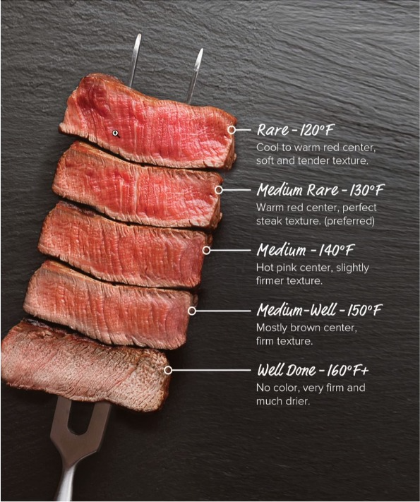

    #Desafio com If, Elif, Else
    ## Termometro
        ### Criar um programa que dependendo da temperatuda (em celsius) do steak ele retonar o ponto de cozimento em portugues. O usuário deverá fornecer a temperatura.
        ### Temperaturas - Cozimento
        #### 120F ou 48C - Rare (Selada)
        #### 130F ou 54C - Medium rare (Ao ponto para o mal)
        #### 140F ou 60C - Medium (Ao ponto)
        #### 150F ou 65C - Medium well (Ao ponto para o bem)
        #### 160F ou 71C - Well done (Bem passada)

